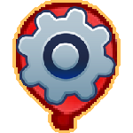

<h1 align="center">CustomBloon</h1>

Like customizable tower but with a bloon instead!

Limited for now but more features will be added later on.

<h1 aling="left"></h1>

If you want to change any displays/icons for the bloon simply download this source code and change the pngs and compile the mod yourself. 

# VIDEO TUTORIAL [HERE](https://www.youtube.com/watch?v=ART9acrIMgU) (the video's for customizable tower but same principle here)

You'll need Visual Studio and .net 6.0. In the mod menu create a mod called CustomBloon and put the source code into the mod folder.
You can see where the mod sources are kept in the config for the Mod Helper.
After that open the .sln file which should be called CustomBloon.sln and go to build and click on Build CustomBloon, Build Solution (which is used when you have multiple projects in the solution) or press Ctrl+B.
Make sure you delete the original .dll first. 

<h1 align="center"Join The Discord!</h1>

